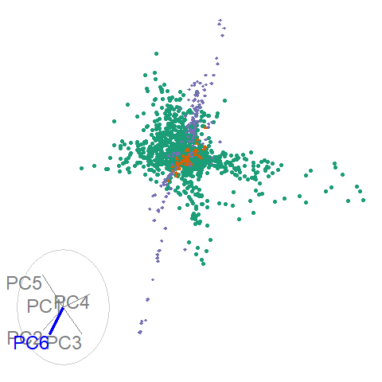

class: inverse

```{css, echo=FALSE}
/* custom.css */
.left-code {
  color: #777;
  width: 48%;
  height: 92%;
  float: left;
}
.right-plot {
  width: 50%;
  float: right;
  padding-left: 1%;
}
```


```{r setup, include=FALSE}
options(htmltools.dir.version = FALSE, width = 120)

library(tidyverse)
library(knitr)
library(kableExtra)
library(fontawesome) #devtools::install_github("rstudio/fontawesome")
library(lubridate)
library(htmltools)
library(datasauRus)
library(gganimate)
library(tsibble)
library(plotly)

opts_chunk$set(
  echo = FALSE, warning = FALSE, message = FALSE, comment = "#>",
  fig.path = 'figure/', cache.path = 'cache/', fig.align = 'center',
  fig.width = 12, fig.height = 4, fig.show = 'hold',
  cache = TRUE, external = TRUE, dev = 'png', dev.args = list(bg = "transparent")
)

mp4_vid <- function(src){
  HTML(
    paste0(
      '<video autoplay>
        <source src="', src, '" type="video/mp4">
      </video>'
    )
  )
}

hook_output <- knit_hooks$get("output")
knit_hooks$set(output = function(x, options) {
   lines <- options$output.lines
   if (is.null(lines)) {
     return(hook_output(x, options))  # pass to default hook
   }
   x <- unlist(strsplit(x, "\n"))
   more <- "..."
   if (length(lines)==1) {        # first n lines
     if (length(x) > lines) {
       # truncate the output, but add ....
       x <- c(head(x, lines), more)
     }
   } else {
     x <- c(more, x[lines], more)
   }
   # paste these lines together
   x <- paste(c(x, ""), collapse = "\n")
   hook_output(x, options)
 })

theme_set(
  theme_grey(base_size = 16) +
  theme(
    legend.position = "bottom",
    plot.background = element_rect(fill = "transparent"),
    legend.background = element_rect(fill = "transparent")
  )
)
```

.title[gganimate]
.sticker-float[]

## The grammar of animation

.bottom[
### Mitchell O'Hara-Wild (`r fa("twitter", fill="#1da1f2")`[@mitchoharawild](https://twitter.com/mitchoharawild))
### Ursula Laa (`r fa("twitter", fill="#1da1f2")`[@UschiLaa](https://twitter.com/UschiLaa/))
### Nicholas Spyrison (`r fa("twitter", fill="#1da1f2")`[@nspyrison](https://twitter.com/nspyrison/))


### 22 March 2019
### Slides @ [mitchelloharawild.com/wombat-gganimate](https://mitchelloharawild.com/wombat-gganimate)
]

---
class: inverse

---
class: inverse

.animated.rubberBand.title[gganimate]
.sticker-float[]

---
class: inverse

.title[gganimate]
.sticker-float[]

.animated.rubberBand[
.desc[The grammar of animation]
]

---
class: inverse

.title[gganimate]
.sticker-float[]

.desc[The grammar of animation]

.bottom[
.animated.zoomInDown[
### Mitchell O'Hara-Wild (`r fa("twitter", fill="#1da1f2")`[@mitchoharawild](https://twitter.com/mitchoharawild))
### Ursula Laa (`r fa("twitter", fill="#1da1f2")`[@UschiLaa](https://twitter.com/UschiLaa/))
### Nicholas Spyrison (`r fa("twitter", fill="#1da1f2")`[@nspyrison](https://twitter.com/nspyrison/))

### &nbsp;
### &nbsp;
]
]

---
class: inverse

.title[gganimate]
.sticker-float[]

.desc[The grammar of animation]

.bottom[
### Mitchell O'Hara-Wild (`r fa("twitter", fill="#1da1f2")`[@mitchoharawild](https://twitter.com/mitchoharawild))
### Ursula Laa (`r fa("twitter", fill="#1da1f2")`[@UschiLaa](https://twitter.com/UschiLaa/))
### Nicholas Spyrison (`r fa("twitter", fill="#1da1f2")`[@nspyrison](https://twitter.com/nspyrison/))


.animated.bounceInRight[
### 22 March 2019
### Slides @ [mitchelloharawild.com/wombat-gganimate](https://mitchelloharawild.com/wombat-gganimate)
]
]

---
class: inverse

.animated.hinge.title[gganimate]
.animated.hinge.sticker-float[]

.animated.hinge[
.desc[The grammar of animation]
]

.animated.hinge.bottom[
### Mitchell O'Hara-Wild (`r fa("twitter", fill="#1da1f2")`[@mitchoharawild](https://twitter.com/mitchoharawild))
### Ursula Laa (`r fa("twitter", fill="#1da1f2")`[@UschiLaa](https://twitter.com/UschiLaa/))
### Nicholas Spyrison (`r fa("twitter", fill="#1da1f2")`[@nspyrison](https://twitter.com/nspyrison/))

### 22 March 2019
### Slides @ [mitchelloharawild.com/wombat-gganimate](https://mitchelloharawild.com/wombat-gganimate)
]
]

---

## What is `gganimate`?

.pull-left[
An extension to the grammar of graphics for animation.

Specifically allows animations to be added to ggplot2 using a grammar of animation.
]

.pull-right[
```{r}
mp4_vid("resources/gganimate.mp4")
```
]

---

## Brief history of `gganimate`

.pull-left[
.rounded-circle[]

Author: David Robinson.

Primarily developed in 2016.

Interface featured frame-by-frame animation building.
]


.pull-right[


Author: Thomas Lin Pedersen.

Reimagined between 2017 and 2018.

Re-built completely to support a grammar of animation with smooth transitions.
]


---
class: center


## Why should I animate?

<hr>

### Improves graphical re-orientation in time and space.

<br>

--

### More compact delivery of information.

<br>

--

### Allows for guided exploration of data, great for talks.

<br>

--

.animated.bounceIn[
### Attention grabbing. 
#### (Tired students? Zzz...)
]

---

## Considerations in making effective animations

<hr>

### Pace: speed of animation

Quick animations may be hard to follow.
Slow animations are boring and tedious.

--

### Perplex: amount of information

It is easy for animations to be overwhelming and confusing.
Multiple simple animations can be easier to digest.

--

### Purpose: Usefulness of using animation

Is animation needed? Does it provide additional value?

---

## Usefulness of animation

### Static

```{r ts-static, echo = FALSE, fig.height = 6}
tsibbledata::aus_elec %>% 
  filter(State == "Victoria") %>% 
  ggplot(aes(x = Time, y = Demand)) + 
  geom_line() + 
  labs(title = "Half-hourly electricity demand", subtitle = "Victoria, Australia (2012-2014)")
```

---

## Usefulness of animation

### Static

```{r ts-static-zoom, echo = FALSE, fig.height = 6}
tsibbledata::aus_elec %>% 
  filter(State == "Victoria", yearmonth(Time) == yearmonth("2014 June")) %>% 
  ggplot(aes(x = Time, y = Demand)) + 
  geom_line() + 
  labs(title = "Half-hourly electricity demand", subtitle = "Victoria, Australia (June 2014)")
```

---

## Usefulness of animation

### Animated

```{r ts-animated, eval = FALSE, echo = FALSE, message = FALSE}
p <- tsibbledata::aus_elec %>% 
  filter(State == "Victoria") %>% 
  ggplot(aes(x = Time, y = Demand)) + 
  geom_line() + 
  labs(title = "Half-hourly electricity demand", subtitle = "Victoria, Australia") +
  transition_states(State, wrap = FALSE) + 
  view_step_manual(1,10,
                   c(ymd_hms("2012-01-01 00:00:00"), ymd_hms("2013-7-01 00:00:00")),
                   c(ymd_hms("2014-12-31 23:59:59"), ymd_hms("2013-7-30 23:59:59")),
                   c(2857.946, 3034.097),
                   c(9345.004,  6543.203),
                   wrap = FALSE)

anim_save("resources/ts-zoom.mp4", p, renderer = ffmpeg_renderer(options = list(pix_fmt = "yuv420p")),
          width = 900, height = 500)
```
```{r}
mp4_vid("resources/ts-start.mp4")
```

---

## Usefulness of animation

### Animated

```{r}
mp4_vid("resources/ts-zoom.mp4")
```

---

## Usefulness of animation

### Interactive

```{r ts-interactive, echo = FALSE, eval = FALSE}
p <- tsibbledata::aus_elec %>% 
  filter(State == "Victoria") %>% 
  ggplot(aes(x = Time, y = Demand)) + 
  geom_line() + 
  labs(title = "Half-hourly electricity demand", subtitle = "Victoria, Australia") 
htmlwidgets::saveWidget(ggplotly(p), "~/github/gganimate-workshop/resources/electricity_plotly.html")
```

<iframe src="resources/electricity_plotly.html" width = "1000px", height = "400px" seamless="seamless" frameBorder="0"></iframe> 


---

## Usefulness of animation

### Static

```{r bc-static, fig.height = 6}
tsibbledata::aus_retail %>% 
  filter(Industry == "Food retailing") %>% 
  summarise(Turnover = sum(Turnover)) %>% 
  mutate(`Box-Cox (lambda = 0.5)` = fablelite::box_cox(Turnover, 0.5), log(Turnover)) %>% 
  gather(Transformation, Value, factor_key = TRUE) %>% 
  ggplot(aes(x = Month, y = Value)) + 
  geom_line() + 
  facet_wrap(vars(Transformation), ncol = 3, scales = "free_y")
```

---

## Usefulness of animation

### Animated

```{r bc-anim, fig.height = 6}
library(rlang)
food_bc <- tsibbledata::aus_retail %>% 
  filter(Industry == "Food retailing") %>% 
  summarise(Turnover = sum(Turnover)) %>% 
  mutate(!!!set_names(map(seq(0,1,0.01), ~ expr(fablelite::box_cox(Turnover, !!.x))), seq(0,1,0.01))) %>% 
  gather(lambda, Turnover) %>% 
  mutate(lambda = as.numeric(lambda))

p <- food_bc %>% 
  ggplot(aes(x = Month, y = Turnover)) + 
  geom_line() + 
  transition_states(1 - lambda, state_length = 0) + 
  view_follow() + 
  ggtitle("Box-Cox transformed food retailing turnover (lambda = {format(1 - as.numeric(closest_state), digits = 2)})")
animate(p, width = 900, height = 500, start_pause = 5, end_pause = 5, nframes = 110)
```

---

## Usefulness of animation

### Interactive

```{r BoxCoxShiny, echo=FALSE}
knitr::include_app("https://ebsmonash.shinyapps.io/gganimateBoxCox/",
  height = "650px")
```

---
class: inverse, center, middle

.sticker-float[]

.title[Your turn]

# Think how you can use animations

---
## The basis - ggplot2

<hr>

<br>

> a system for declaratively creating graphics, based on "The Grammar of Graphics"


Based on three simple concepts:

 * __Data__: input data should be formated in a data frame, where each column is a variable, and each row is an observation
 * __Mapping__: declaring a mapping of input data variables onto aestetics
 * __geoms__: the graphical primitives, e.g. geom_line, geom_point

---

## Basic workflow

<hr>
<br>
<br>
--

### Initialise a ggplot by passing in data and mapping

--

### Add layers with graphical primitives (geoms)


--

### Add formatting specifications

--

### Add animation specifications
<br>

--

### Let's try some simple examples!

---
## A simple example
### Using the economics dataset

Let's start by passing the data to ggplot

.left-code[
```{r plot1, eval=FALSE, echo=TRUE}
ggplot(economics) #<<
```
]
.right-plot[
```{r output1, ref.label="plot1", echo=FALSE, cache=TRUE, fig.height = 8}
```
]

---
## A simple example
### Using the economics dataset
The next step is to add the mapping

.left-code[
```{r plot2, eval=FALSE, echo=TRUE}
ggplot(economics) +
  aes(date, unemploy)#<<
```
]
.right-plot[
```{r output2, ref.label="plot2", echo=FALSE, cache=TRUE, fig.height = 8}
```
]
---
## A simple example
### Using the economics dataset
Now we can add a graphical primitive, let's try a scatter plot

.left-code[
```{r plot3, eval=FALSE, echo=TRUE}
ggplot(economics) +
  aes(date, unemploy) +
  geom_point() #<<
```
]
.right-plot[
```{r output3, ref.label="plot3", echo=FALSE, cache=TRUE, fig.height = 8}
```
]
---
## A simple example
### Using the economics dataset
Actually a line graph is better suited in this case

.left-code[
```{r plot4, eval=FALSE, echo=TRUE}
ggplot(economics) +
  aes(date, unemploy) +
  geom_line() #<<
```
]
.right-plot[
```{r output4, ref.label="plot4", echo=FALSE, cache=TRUE, fig.height = 8}
```
]

---
## A simple example
### Using the economics dataset
Just one extra line turns this into an animation!

.left-code[
```{r plot5-anim, eval=FALSE, echo=TRUE}
ggplot(economics) +
  aes(date, unemploy) +
  geom_line() +
  transition_reveal(date) #<<
```
]
.right-plot[
```{r output5-anim, ref.label="plot5-anim", echo=FALSE, cache=TRUE, fig.height = 8}
```
]
---
## A not-so-simple example, the datasaurus dozen
Again, we first pass in the dataset to ggplot

.left-code[
```{r plot5, eval=FALSE, echo=TRUE}
ggplot(datasaurus_dozen)#<<
```
]
.right-plot[
```{r output5, ref.label="plot5", echo=FALSE, cache=TRUE, fig.height = 10}
```
]
---
## A not-so-simple example, the datasaurus dozen
For each dataset we have x and y values, in addition we can map dataset to color

.left-code[
```{r plot6, eval=FALSE, echo=TRUE}
ggplot(datasaurus_dozen) +
  aes(x, y, color=dataset)#<<
```
]
.right-plot[
```{r output6, ref.label="plot6", echo=FALSE, cache=TRUE, fig.height = 10}
```
]
---
## A not-so-simple example, the datasaurus dozen
Trying a simple scatter plot first, but there is too much information
.left-code[
```{r plot7, eval=FALSE, echo=TRUE}
ggplot(datasaurus_dozen) +
  aes(x, y, color=dataset) +
  geom_point() #<<
```
]
.right-plot[
```{r output7, ref.label="plot7", echo=FALSE, cache=TRUE, fig.height = 10}
```
]
---
## A not-so-simple example, the datasaurus dozen
We can use facets to split up by dataset, revealing the different distributions
.left-code[
```{r plot8, eval=FALSE, echo=TRUE}
ggplot(datasaurus_dozen) +
  aes(x, y, color=dataset) +
  geom_point() +
  facet_wrap(~dataset)#<<
```
]
.right-plot[
```{r output8, ref.label="plot8", echo=FALSE, cache=TRUE, fig.height = 10}
```
]
---
## A not-so-simple example, the datasaurus dozen
We can just as easily turn it into an animation, transitioning between dataset states! 

.left-code[
```{r plot9, eval=FALSE, echo=TRUE}
ggplot(datasaurus_dozen) +
  aes(x, y) +
  geom_point() +
  transition_states(dataset, 3, 1) + #<<
  labs(title = "Dataset: {closest_state}") #<<

```
]
.right-plot[
```{r output9, ref.label="plot9", echo=FALSE, cache=TRUE, fig.height = 10}
```
]


---

class: inverse, middle

.sticker-float[]

# The grammar of animation

<hr>
### Controlling plot movement with:


- ### Transitions
- ### Views
- ### Shadows
- ### Entrances/Exits
- ### Easing

---

## Transitions

How the data changes through the animation.

```{r transition-tbl}
tribble(
  ~ Function, ~ Description,
  "transition_manual", "Build an animation frame by frame (no tweening applied).",
  "transition_states", "Transition between frames of a plot (like moving between facets).",
  "transition_time", "Like transition_states, except animation pacing respects time.",
  "transition_components", "Independent animation of plot elements (by group).",
  "transition_reveal", "Gradually extends the data used to reveal more information.",
  "transition_layers", "Animate the addition of layers to the plot. Can also remove layers.",
  "transition_filter", "Transition between a collection of subsets from the data.",
  "transition_events", "Define entrance and exit times of each visual element (row of data)."
) %>% 
  kable(format = "html") %>%
  kableExtra::kable_styling(font_size = 26)
```

---

## Transitions

Which transition was used in the following animations?

.pull-left[
```{r transition-layers}
ggplot(mtcars, aes(mpg, disp)) +
  geom_point() +
  geom_smooth(colour = 'grey', se = FALSE) +
  geom_smooth(aes(colour = factor(gear))) +
  transition_layers(layer_length = 1, transition_length = 2,
                    from_blank = FALSE, keep_layers = c(Inf, 0, 0)) +
  enter_fade() + exit_fade()
```
]
--

.pull-right[
`transition_layers()`

New layers are being added (and removed) over the dots.
]

--

<hr>

.pull-right[
```{r tile-average, eval = FALSE, echo = FALSE}
tile_window <- tiler(elec_jan$datetime, .size = 24) %>%
  map_dfr(function(x) tibble(xmin = min(x), xmax = max(x))) %>%
  mutate(ymin = -Inf, ymax = Inf, group = row_number())
elec_tile_mean <-
  tibble(
    datetime = make_datetime(2013, 1, 1:15, hour = 12),
    ma_kwh24 = tile_dbl(elec_jan$avg_kwh, ~ mean(.x), .size = 24)
  ) %>%
  mutate(group = row_number())
elec_tile_revealed <- elec_tile_mean %>%
  reveal_group(group)
elec_tile_mean <- ggplot() +
  geom_line(aes(x = datetime, y = avg_kwh), data = elec_jan, colour = "grey", size = 1.2) +
  geom_rect(aes(
    xmin = xmin, xmax = xmax,
    ymin = ymin, ymax = ymax,
    group = group
  ), data = tile_window, fill = "#9ecae1", alpha = 0.6) +
  geom_point(aes(x = datetime, y = ma_kwh24), data = elec_tile_mean, size = 2, colour = "#de2d26") +
  geom_line(aes(x = datetime, y = ma_kwh24), data = elec_tile_revealed, size = 1.2, colour = "#de2d26") +
  xlab("Time") +
  ylab("Average kwH") +
  ylim(c(0, max(elec_jan$avg_kwh))) +
  theme_bw() +
  transition_manual(group)
anim_save("tile-mean.gif", elec_tile_mean, width = 800, height = 250)
```


]

--

.pull-left[
`transition_manual()`

No tweening is evident between frames, highlighting the discrete nature of the tiling function.
]

---

## Views

How the plot window changes through the animation.

```{r views-tbl}
tribble(
  ~ Function, ~ Description,
  "view_follow", "Change the view to follow the range of current data.",
  "view_step", "Similar to view_follow, except the view is static between transitions.",
  "view_step_manual", "Same as view_step, except view ranges are manually defined.",
  "view_zoom", "Similar to view_step, but appears smoother by zooming out then in.",
  "view_zoom_manual", "Same as view_zoom, except view ranges are manually defined."
) %>% 
  kable(format = "html") %>%
  kableExtra::kable_styling(font_size = 26)
```

---

## Views

Which view was used in the following animations?

.pull-left[
```{r}
mp4_vid("resources/ts-zoom.mp4")
```
]
--

.pull-right[
`view_step_manual()`

The view is changed without modifying the data. You can see the lines are shown without margins.
]

--

<hr>

.pull-right[
```{r view-follow}
ggplot(iris, aes(Sepal.Length, Sepal.Width)) +
  geom_point() +
  labs(title = "{closest_state}") +
  transition_states(Species, transition_length = 4, state_length = 1) +
  view_follow()
```
]

--

.pull-left[
`view_follow()`

Plot axis follows the range of the data.
]

---

## Shadows

How the history of the animation is shown. Useful to indicate speed of changes.

```{r shadows-tbl}
tribble(
  ~ Function, ~ Description,
  "shadow_mark", "Previous (and/or future) frames leave permananent background marks.",
  "shadow_trail", "Similar to shadow_mark, except marks are from tweened data.",
  "shadow_wake", "Shows a shadow which diminishes in size and/or opacity over time."
) %>% 
  kable(format = "html") %>%
  kableExtra::kable_styling(font_size = 26)
```

---

## Shadows

Which shadow was used in the following animations?

.pull-left[
```{r shadow-wake}
ggplot(iris, aes(Petal.Length, Sepal.Length)) +
  geom_point(size = 2) +
  labs(title = "{closest_state}") +
  transition_states(Species, transition_length = 4, state_length = 1) +
  shadow_wake(wake_length = 0.1)
```
]
--

.pull-right[
`shadow_wake()`

The older tails of the points shrink in size, leaving a "wake" behind it.
]

--

<hr>

.pull-right[
```{r shadow-mark}
ggplot(airquality, aes(Day, Temp)) +
  geom_line(color = 'red', size = 1) +
  transition_time(Month) +
  shadow_mark(colour = 'black', size = 0.75)
```
]

--

.pull-left[
`shadow_mark()`

Permanent marks are left by previous points in the animation.
]

---

## Entrances and exits

How elements of the plot appear and disappear.

```{r enter-exit-tbl}
tribble(
  ~ Function, ~ Description,
  "enter_appear/exit_disappear", "Poof! Instantly appears or disappears.",
  "enter_fade/exit_fade", "Opacity is used to fade in or out the elements.",
  "enter_grow/exit_shrink", "Element size will grow from or shrink to zero.",
  "enter_recolour/exit_recolour", "Change element colours to blend into the background.",
  "enter_fly/exit_fly", "Elements will move from/to a specific x,y position.",
  "enter_drift/exit_drift", "Elements will shift relative from/to their x,y position.",
  "enter_reset/exit_reset", "Clear all previously added entrace/exits."
) %>% 
  kable(format = "html") %>%
  kableExtra::kable_styling(font_size = 26)
```

---

## Animation controls

How data moves from one position to another. 

```r
p + ease_aes({aesthetic} = {ease})
p + ease_aes(x = "cubic")
```
[](https://easings.net/)

.footnote[
Source: https://easings.net/
]

---
class: inverse, center, middle

.sticker-float[]

.title[Your turn]

# Making the gapminder animation

<iframe width="560" height="315" src="https://www.youtube-nocookie.com/embed/jbkSRLYSojo?rel=0&amp;start=240" frameborder="0" allow="accelerometer; autoplay; encrypted-media; gyroscope; picture-in-picture" allowfullscreen></iframe>

---

## Making the gapminder animation
### Load the data and set the theme

.left-code[
```{r gm_plot1, echo=T, eval=F}
library(gapminder) #<<
theme_set(theme_bw()) #<<
```
]
.right-plot[
```{r gm_output1, ref.label="gm_plot1", echo=FALSE, cache=TRUE, fig.height = 10}
```
]

---

## Making the gapminder animation
### Define the aesthetics

.left-code[
```{r gm_plot2, echo=T, eval=F}
library(gapminder)
theme_set(theme_bw())

ggplot(gapminder) + #<<
  aes(x = gdpPercap, y=lifeExp, #<<
      size = pop, colour = country) #<<
```
]
.right-plot[
```{r gm_output2, ref.label="gm_plot2", echo=FALSE, cache=TRUE, fig.height = 10}
```
]

---

## Making the gapminder animation
### The plot is feeling a bit pointless...

.left-code[
```{r gm_plot3, echo=T, eval=F}
library(gapminder)
theme_set(theme_bw())

ggplot(gapminder) +
  aes(x = gdpPercap, y=lifeExp,
      size = pop, colour = country) +
  geom_point(show.legend = FALSE)  #<<
```
]
.right-plot[
```{r gm_output3, ref.label="gm_plot3", echo=FALSE, cache=TRUE, fig.height = 10}
```
]

---

## Making the gapminder animation
### Transform the axis

.left-code[
```{r gm_plot4, echo=T, eval=F}
library(gapminder)
theme_set(theme_bw())

ggplot(gapminder) +
  aes(x = gdpPercap, y=lifeExp,
      size = pop, colour = country) +
  geom_point(show.legend = FALSE) +
  scale_x_log10() #<<
```
]
.right-plot[
```{r gm_output4, ref.label="gm_plot4", echo=FALSE, cache=TRUE, fig.height = 10}
```
]

---

## Making the gapminder animation
### Customise the colour and size of points

.left-code[
```{r gm_plot5, echo=T, eval=F}
library(gapminder)
theme_set(theme_bw())

ggplot(gapminder) +
  aes(x = gdpPercap, y=lifeExp,
      size = pop, colour = country) +
  geom_point(show.legend = FALSE) +
  scale_x_log10() +
  scale_color_viridis_d() + #<<
  scale_size(range = c(2, 12)) #<<
```
]
.right-plot[
```{r gm_output5, ref.label="gm_plot5", echo=FALSE, cache=TRUE, fig.height = 10}
```
]

---

## Making the gapminder animation
### Add some labels

.left-code[
```{r gm_plot7, echo=T, eval=F}
library(gapminder)
theme_set(theme_bw())

ggplot(gapminder) +
  aes(x = gdpPercap, y=lifeExp,
      size = pop, colour = country) +
  geom_point(show.legend = FALSE) +
  scale_x_log10() +
  scale_color_viridis_d() +
  scale_size(range = c(2, 12)) +
  labs(x = "GDP per capita", y = "Life expectancy") #<<
```
]
.right-plot[
```{r gm_output7, ref.label="gm_plot7", echo=FALSE, cache=TRUE, fig.height = 10}
```
]

---

## Making the gapminder animation
### Time to animate!

```{r gm_plot1agian, echo=T, eval=F}
library(gapminder)
theme_set(theme_bw())

ggplot(gapminder) + 
  aes(x = gdpPercap, y=lifeExp, 
      size = pop, colour = country)) +
  geom_point(show.legend = FALSE) +
  scale_x_log10() +
  scale_color_viridis_d() +
  scale_size(range = c(2, 12)) +
  labs(x = "GDP per capita", y = "Life expectancy") +
  ??? #<<
```

--

What are appropriate some appropriate animation features?

--

.pull-left[
- Transitions?
- Views?
]

.pull-right[
- Entrances/Exits?
- Shadows?
]

---

## Transition with time: animating over year

.left-code[
```{r gm_plot2_a, echo=T, eval=F}
library(gapminder)
theme_set(theme_bw())

ggplot(gapminder) + 
  aes(x = gdpPercap, y=lifeExp, 
      size = pop, colour = country) +
  geom_point(show.legend = FALSE) +
  scale_x_log10() +
  scale_color_viridis_d() +
  scale_size(range = c(2, 12)) +
  labs(x = "GDP per capita", y = "Life expectancy") +
  transition_time(year) + #<<
  labs(title = "Year: {frame_time}") #<<
```
]

.right-plot[
```{r gm_output2, ref.label="gm_plot2_a", echo=FALSE, cache=TRUE, fig.height = 10}
```
]

---

## Changing the view: scaling the y-axis to the data

.left-code[
```{r gm_plot3a, echo=T, eval=F}
library(gapminder)
theme_set(theme_bw())

ggplot(gapminder) + 
  aes(x = gdpPercap, y=lifeExp, 
      size = pop, colour = country) +
  geom_point(show.legend = FALSE) +
  scale_x_log10() +
  scale_color_viridis_d() +
  scale_size(range = c(2, 12)) +
  labs(x = "GDP per capita", y = "Life expectancy") +
  transition_time(year) +
  labs(title = "Year: {frame_time}") +
  view_follow(fixed_y = TRUE) #<<
```
]
.right-plot[
```{r gm_output3, ref.label="gm_plot3a", echo=FALSE, cache=TRUE, fig.height = 10}
```
]

--

Does this add value to the animation?

---

## Shadow the past: highlight the rate of change

.left-code[
```{r gm_plot4a, echo=T, eval=F}
library(gapminder)
theme_set(theme_bw())

ggplot(gapminder) + 
  aes(x = gdpPercap, y=lifeExp, 
      size = pop, colour = country) +
  geom_point(show.legend = FALSE) +
  scale_x_log10() +
  scale_color_viridis_d() +
  scale_size(range = c(2, 12)) +
  labs(x = "GDP per capita", y = "Life expectancy") +
  transition_time(year) +
  labs(title = "Year: {frame_time}") +
  shadow_wake(wake_length = 0.1, alpha = FALSE) #<<
```
]
.right-plot[
```{r gm_output4a, ref.label="gm_plot4a", echo=FALSE, cache=TRUE, fig.height = 10}
```
]

Can you see countries that move rapidly?

---

## Add your own flavour!

```{r gm_plot5a, echo=T, eval=F}
library(gapminder)
theme_set(theme_bw())

ggplot(gapminder) + 
  aes(x = gdpPercap, y=lifeExp, 
      size = pop, colour = country) +
  geom_point(show.legend = FALSE) +
  scale_x_log10() +
  scale_color_viridis_d() +
  scale_size(range = c(2, 12)) +
  labs(x = "GDP per capita", y = "Life expectancy") +
  transition_time(year) +
  labs(title = "Year: {frame_time}")
```

- transition_*() family
- view_*() family
- shadow_*() family
- ggplot2 changes


---

## Exporting animations

```{r export, echo=T, eval=F}
anim_save(
  filename = "./images/MyAnim.gif", animation = MyAnim,
  start_pause = 15, width = 480, height = 480, res = 150)
```

```{r, out.width='40%', out.height='40%'}

```

---

## Exporting animations

### Renderer options

```{r renderer-tbl}
tribble(
  ~ Function, ~ Description,
  "gifski_renderer", "Default, super fast gif renderer.",
  "magick_renderer", "Somewhat slower gif renderer.",
  "ffmpeg_renderer", "Uses ffmpeg to create a video from the animation.",
  "av_renderer", "Uses the av package to create a video (using ffmpeg).",
  "file_renderer", "Dumps a list of image frames from the animation.",
  "sprite_renderer", "Creates a spritesheet from frames of the animation."
) %>% 
  kable(format = "html") %>%
  kableExtra::kable_styling(font_size = 26)
```


---
class: inverse, center, middle

.sticker-float[]

.title[Your turn]

# Make your own animation

---

## Simple alternative: Plotly

<hr>

We can also use plotly to easily make simple animations via ggplotly and the frames argument

.left-code[
```{r plotply, eval=FALSE, echo=TRUE}
library(plotly)
p <- ggplot(datasaurus_dozen) +
  aes(x, y, frame = dataset) +
  geom_point()
ggplotly(p)
```

More complicated alternative: use plotly directly (or basic libraries like D3.js) to have more control over the animation details, and e.g. embed them in a Shiny app.

]
.right-plot[
```{r outputply, ref.label="plotply", echo=FALSE, cache=TRUE, fig.height = 5, fig.width=5}
```
]

---
class: center

## Other animation libraries to check out

<br>

### [D3.js](https://d3js.org/)
### [Vega](https://vega.github.io/vega/) / [Vega-lite](https://vega.github.io/vega-lite/)
### [Highcharts](https://www.highcharts.com/)
### [Bokeh](https://bokeh.pydata.org/en/latest/)
### [Seaborn](https://seaborn.pydata.org/)

<br>

This is not exhaustive - there are a lot of animation libraries!
---

class: inverse, top

.sticker-float[]

.title[Thanks! `r fa("comments", fill = "white")`]

<br>

.larger[
`r fa("github", fill = "white")` Learn more on GitHub: [thomasp85/gganimate](https://github.com/thomasp85/gganimate)

`r fa("wikipedia-w", fill = "white")` More examples on the wiki: [thomasp85/gganimate/wiki](https://github.com/thomasp85/gganimate/wiki)

`r fa("desktop", fill = "white")` Review slides: [mitchelloharawild.com/wombat-gganimate](https://mitchelloharawild.com/wombat-gganimate)

<br>

.footnote[This work is licensed as `r fa("creative-commons", fill="white")` BY-NC 4.0.]
]
